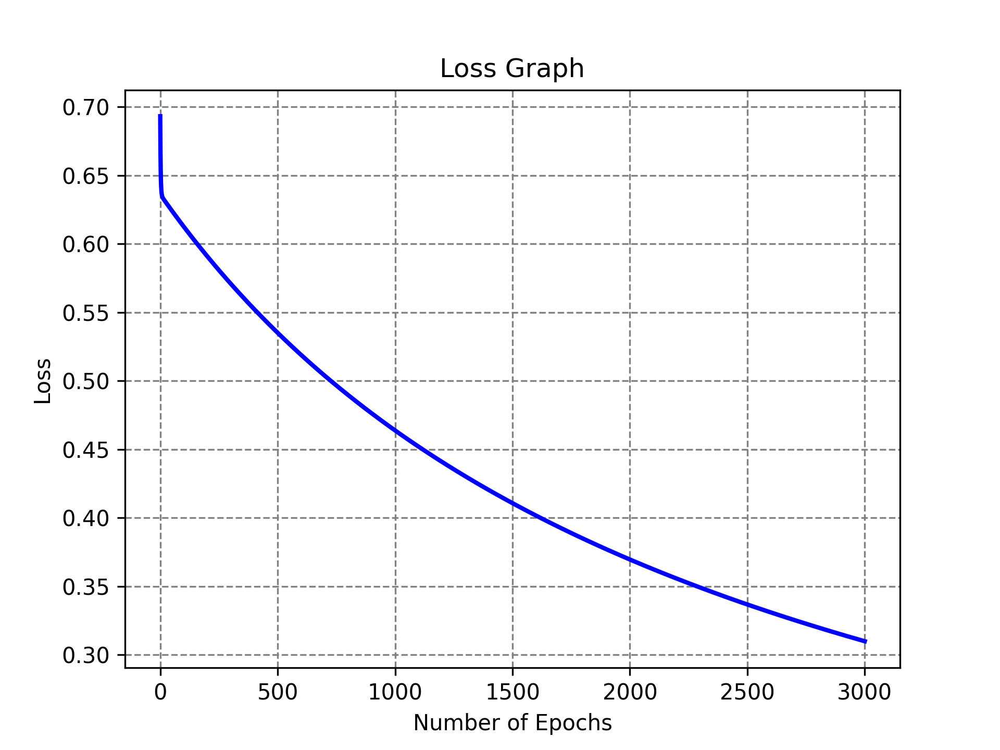
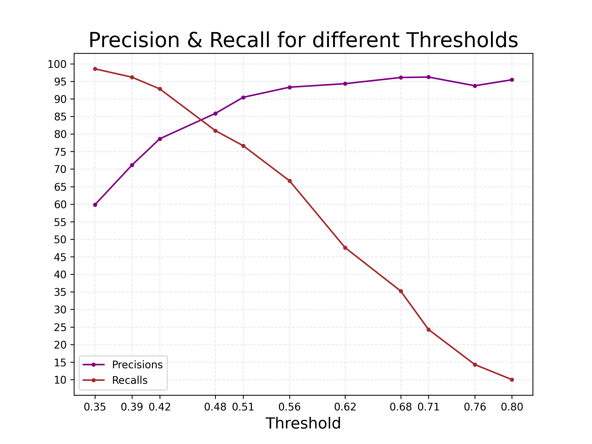

# Spam Email Detection System

This project is built using Python, NumPy, Pandas, and works on the basis of Logistic Regression.

## Description

The project uses the SpamAssassin Public Corpus dataset to train the model using Logistic Regression to identify spam vs. ham emails. It then labels any entered email as spam or ham.

## Dataset

The project uses the SpamAssassin Public Corpus from Kaggle, which includes the folders `easy_ham`, `hard_ham`, and `spam_2` to train the model. The dataset is not included here, but it is free and publicly available.

Link: https://www.kaggle.com/datasets/beatoa/spamassassin-public-corpus

## Technologies Used

* Python
* NumPy
* Pandas
* Matplotlib

## How It Runs

1. Download the SpamAssassin Public Corpus from Kaggle.
2. Add the paths of the folders `easy_ham`, `hard_ham`, and `spam_2`.
3. Make sure NumPy, Pandas, and Matplotlib are installed.
4. Run the code.
5. Input any email to get it labeled as spam or ham.

## How It Works

This project uses Pandas to load and clean the emails from the folders `easy_ham`, `hard_ham`, and `spam_2`, and then splits them into training and test sets using an 80/20 ratio.

It then cleans and tokenizes each email. Afterwards, it builds a vocabulary by selecting words that occur in at least 15 emails. It then converts the emails into TF-IDF feature vectors using term frequency and inverse document frequency.

The model is then trained on the training data using a learning rate of 1 for 3000 epochs and evaluated using a Confusion Matrix, Accuracy, Precision, Recall, and F1.

Precision and Recall are compared across different thresholds, and the best threshold is selected for the classification of emails after evaluation. Afterwards, it is ready to classify any entered email as spam or ham.

## Loss Curve

## Precision vs Recall Curve

## What I Learned

I learned to extract, clean, and prepare data using Pandas. Moreover, I learned to perform feature engineering and use the TF-IDF method.

Since the project is made using NumPy from scratch, it gave me a better understanding of the mechanism behind the working of Logistic Regression, i.e. how to train data and how to evaluate it using different parameters such as Precision and Accuracy. I also learned how TF-IDF works by implementing it using NumPy instead of using a built-in library.
